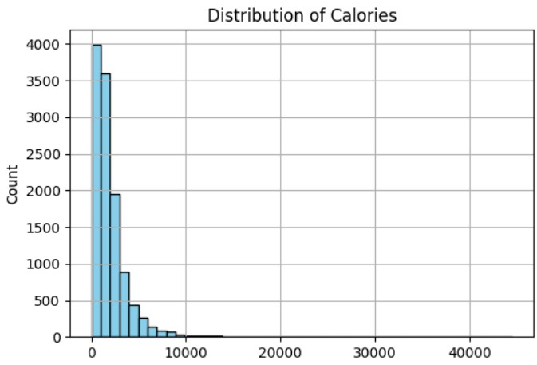

# IIFYMate App - AI Macro Calculator Companion

[Google Play Link](https://play.google.com/store/apps/details?id=com.qml_studios.flavour_quasar_app)

## Introduction

The IIFYMate app is a machine learning app that calcualtes a meals' macronutrients using just its name and dietary type. The aim is to simplify flexible dieting approaches by removing the need to measure every food the user might consume with a food scale, ultimately saving time. Under the hood, 3 machine learning models have been trained on a dataset of recipes with their respective macros, when 1 model is dedicated for 1 macronutrient (protein, carbs, fats). Furthermore, the user can increase accuracy by customizing the ingredients with a simple estimation of their quantity - but still no need to get the exact food/brand of food. 

## Data Collection

The dataset used for this project consists of a collection of recipes, taken from the Edamam API. The only relavant information in this case are the recipe names, macronutrients (target variables), and health label (vegan, vegetarian, pescaterian, etc.). Note, there is another feature in the dataset called the diet type, but since it is irrelecant we will also equivalently call the health label the diet type since it's more clear in meaning. This Edamam API comes with free and paid versions, where the limited free version was used. Unfortunately, this means arbitrary searches can't be made to get a large assortment of random recipes, so instead we searched with single item ingredients, and pulled 100 recipes. Thus, with a list of single ingredients, we pulled 100 recipes for each and so our dataset has 100 times the number of ingredients we use, so more can always be added.

## EDA and Preprocessing

### Input Variables
The final input variables in the end are of course the recipe name and health label. Some recipes were duplicates based on the recipe name, due to the fact that they originated from different websites but were the same otherwise - and so were dropped. Otherwise the dataset was overall clean. The input variable that was the recipe name, which was a text column, naturally did not require much processing. Thus, standard preprocessing steps, like removing stop words, lemmatization, etc., were done, right before tf-idf was applied for model training. The health label had numerous categories, but the most popular ones were selected, such as Vegan, Vegetarian, Mediterranean, etc. - and since this was a multilabel column, a prioirty list was created to collapse it into a single categorical column. Moreover, this led to some recipes with no health label, in which case a new one called 'Balanced' was assigned. This health label is obviously meant to indicate normal meals with no intended dietary restrictions.

### Target Variables
Initially, the original target variable was just the calories. The distribution of it is below, and you can see a large range of values that may not be intuitive. This is because recipes being more than 2000 calories for 1 person is unusual, so the natural assumption is that they must have been large meals for multiple people. Since this is a regression problem, they were kept, but further exploration should be done to consider removing them depending on the apps use case. 

The actual target variables were all three macronutrients. For some reason there was a discrepency in the calories of a recipe and the macronutrients, since a meals total number of calories should be $`9*fat + 4*protein + 4*carbs`$, but it seemed to be lower than the calorie column that already existed. To address this, calories were calculated seperately using the macros, since ultimately the macros are the targets anyway. 

## Modeling

Various models were fitted but XGBoost with tf-idf pre-processing seems to be thes best so far. There are 3 trained models using XGBoost, one for each macronutrient, and each made use of grid search to tune the hyperparameters. Currently model performance is poor, but app is in testing phase for users to validate its basic functionality and use case. Each model works the same way, where the input is the health label, recipe name, and ingredients list. They are all concatenated together before standard preprocessing is done. 

To get the ingredients list, since the user doesn't manually input them, an additional model, namely the cosine similarity is used to compare the users recipe name against the database of recipes to see what's most similar. The result of this the index of the recipe in the dataframe, which is used to get the respective ingredients list to autopopulate the ingredients in the app (after the user clicks on the Edit Ingredients button). 

## Deployment and Future Improvements

The machine learning models were deployed in a flask app using google cloud run. The models are also currently in Vertex AI but were copied into the docker image for speed and model tracking will likely be moved to an open source tool.

The app is in testing phase to validate it's use case and get user feedback. Latest concerns are the edit ingredients feature, in that allowing the user to customize the ingredients for greater accuracy defeats the purpose of this simplistic nature of the app. Additional functionality would be to reverse the current one, meaning predict a meal given the allowed maconutrient profile and health label. An LLM could be trained to predict ingredients and/or the recipe name for this.
